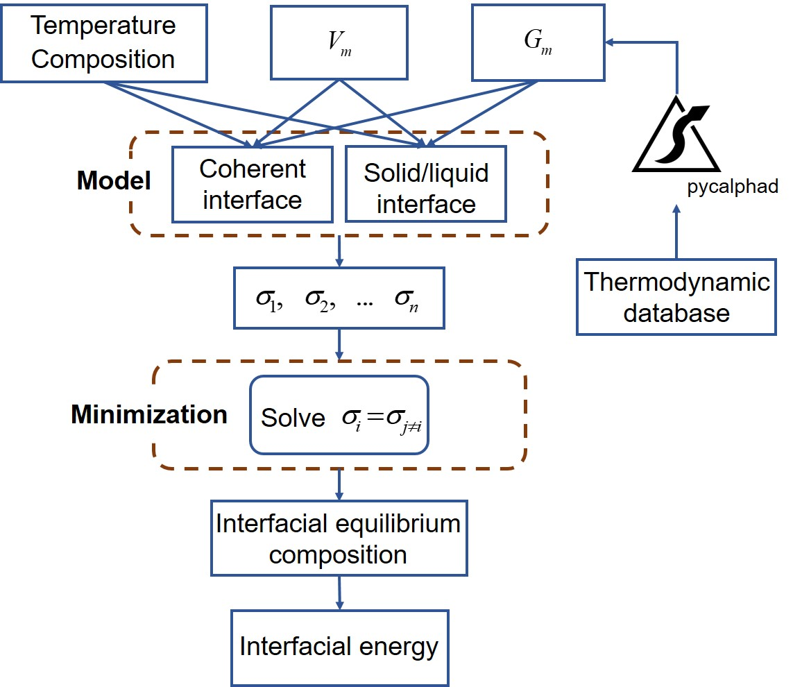
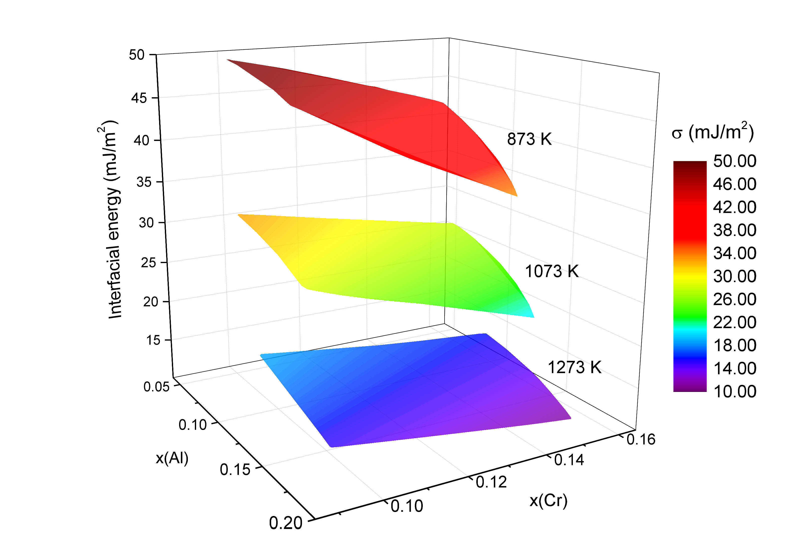

<!--   -->
## OpenIEC: An open-source code for interfacial energy calculation in alloys

**Designed at Central South University, China**

**Developer:** Shenglan Yang, Jing Zhong, Lijun Zhang

**Notes:** If you use OpenIEC in your research or publish, please cite or acknowledge the following work :

> Shenglan Yang, Jing Zhong, Jiong Wang, Lijun Zhang*, George Kaptay. OpenIEC: An open-source code for interfacial energy calculation in alloys[J]. To be submitted. DOI: http://doi.org/.

OpenIEC is an open-source code for interfacial energy calculation in alloys and was developed by following interfacial energy calculation models on coherent and solid/liquid interfaces developed by George Kaptay (*Acta Mater.*, 60 (2012) 6804-6813 & *J. Mater. Sci.*, 53 (2018) 3767-3784).

For assistance and/or collaboration opportunities, please contact the author by e-mail (@gmail.com) or using the issue tracker on GitHub.

**Framework of OpenIEC code**
<center>
 
</center>

The coupling with the [CALculation of PHAse Diagram (CALPHAD)](https://en.wikipedia.org/wiki/CALPHAD) thermodynamic and molar volume databases was facilitated in OpenIEC for providing the necessary thermodynamic information. For the coupling to thermodynamic database, the integration with the [Pycalphad](https://pycalphad.org) software package is to be performed. With OpenIEC, the temperature- and composition-dependent interfacial energies in alloys with any arbitrary number of components can be conveniently evaluated.
<!-- <center>
 
</center>
 <div align="center"> Framework of OpenIEC code </div>
</br> -->

OpenIEC is licensed under the MIT License. See [LICENSE.txt](./LICENSE.txt) for details.

### Prerequisite and Installation

- Python 3.6 or above
- Python libraries: numpy, scipy, sympy, xarray
- OpenIEC deponds on the [pycalphad](https://github.com/pycalphad/pycalphad) package. Installation instructions for [pycalphad](https://github.com/pycalphad/pycalphad) can be found on https://pycalphad.org.

To install OpenIEC, one should go to the source directory and run: 

    python setup.py install

### Qucikstart

**Calculation of the coherent interfacial energy**

- Ni-Al system
- Coherent interfacial energy between FCC_A1 and GAMMA_PRIME
- Temperature: 800 K
- Composition: Ni-20at.%Al
- TDB file: [NiAl.tdb](./demo/NiAl.tdb)

Write a script to use OpenIEC as following,

```python
from pycalphad import Database
from openiec.calculate.calcsigma import SigmaCoherent

# Render thermodynamic database.
db = Database("NiAl.tdb")
# Molar volumes of pure components to construct corresponding molar volume database.
purevms = [[
        "6.718*10.0**(-6.0) + (2.936*10.0**(-5)*10.0**(-6.0))*T**(1.355*10.0**(-6.0))", 
        "10.269*10.0**(-6.0) + (3.860*10.0**(-5)*10.0**(-6.0))*T**(1.491*10.0**(-6.0))"
    ],]*2
# Call the module for calculating coherent interfacial energies.
sigma = SigmaCoherent(
    T = 800.0, 
    x0 = [0.2,], 
    db = db, 
    comps = ["NI", "AL", "VA"], 
    phasenames = ["FCC_A1", "GAMMA_PRIME"], 
    purevms = purevms
)
# Print the calculated interfacial energy.
print(sigma.Interfacial_Energy.values)

Output: 0.027399568639258774
```

**Calculation of the solid/liquid interfacial energy**
- Ni-Al system
- Solid/liquid interfacial energy between FCC_A1 and Liquid
- Temperature: 916 K
- Composition: Al-1at.%Ni
- TDB file: [AlNi1997.TDB](./demo/AlNi1997.TDB)

```python
from pycalphad import Database
from openiec.calculate.calcsigma import SigmaSolLiq

# Render thermodynamic database.
db = Database("AlNi1997.TDB")
# Molar volumes of pure components to construct corresponding molar volume database.
purevms = [[
        "10.269*10.0**(-6.0) + (3.860*10.0**(-5)*10.0**(-6.0))*T**(1.491*10.0**(-6.0))", 
        "6.718*10.0**(-6.0) + (2.936*10.0**(-5)*10.0**(-6.0))*T**(1.355*10.0**(-6.0))"
    ],]*2
# Call the module for calculating solid/liquid interfacial energies.
sigma = SigmaSolLiq(
    T = 916.0, 
    x0 = [0.01,], 
    db = db, 
    comps = ["AL", "NI"], 
    phasenames = ["FCC_A1", "LIQUID"] , 
    purevms = purevms
) 
# Print the calculated interfacial energy.
print(sigma.Interfacial_Energy.values) 

Output: 0.16942787117258445

```

**More Examples**
- [Calculating the coherent interfacial energy of the binary Ni-Al alloy](./demo/bin_coherent_NiAl.py)
- [Calculating the coherent interfacial energy of the ternary Ni-Al-Cr alloy](./demo/ter_coherent_NiAlCr.py)
- [Calculating the solid/liquid interfacial energy of the pure metal](./demo/pure_solliq.py)
- [Calculating the solid/liquid interfacial energy of the binary Al-Ni alloy](./demo/bin_solliq_AlNi.py)
- [Calculating the solid/liquid interfacial energy of the ternary Al-Ag-Cu alloy](./demo/ter_solliq_AlAgCu.py)

*Notes*:  If you run examples in OpenIEC, please enter the demo file in the source directory and type the following code.

    python ter_solliq_AlAgCu.py

### Documentation

- [Coherent Interfacial Energy](./docs/coherent.md)
- [Solid/Liquid Interfacial Energy](./docs/solid-liquid.md)

### Representative results
- Calculated interfacial energies of coherent *γ*/*γ'* interface in the Ni-Al system using OpenIEC, compared with literature data.
<center>
 
</center>
</br>

- Model-predicted interfacial energies of the coherent *γ*/*γ'* interface in the Ni-Al-Cr system at 873 K, 1073K and 1273 K.
<center>
 
</center>
</br>

- Model-predicted interfacial energy cube of coherent *γ*/*γ'* interface in the Ni-Al-Cr-Re system at 1273 K.
<center>
 
</center>
